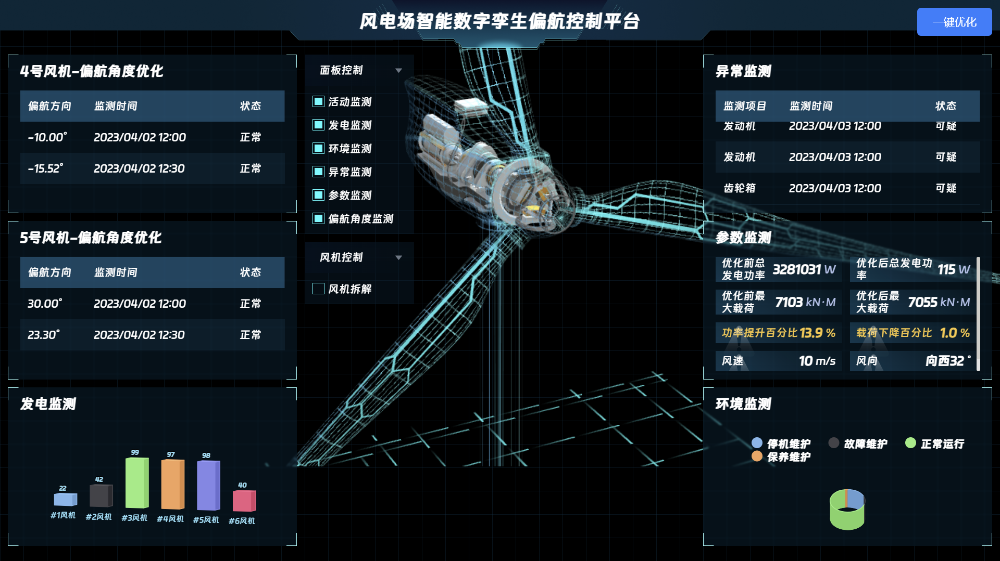

# 17届全国节能减排社会实践与科技创新竞赛
## 作品名称：“御风而行，构建风场智慧大脑”WindBrain风电场数字孪生智能偏航优化控制平台
- TurbineMonitor: 项目的前端代码
  - 运行方式说明（首先确保安装有Node.js和npm）：
    1. clone代码至本地
    2. 运行"npm install"安装必要的组件 
    3. 运行"npm run dev"在本地端口查看网页效果
   
- 说明书
- 演示视频
- 作品标志图